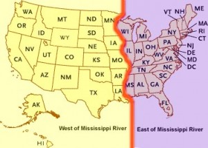

# I Title
## "Go West, (Gluten-Free) Young Man"
### Gluten-Free Restaurants on Yelp.com Follow the United States Population Migration to the West of the Mississippi River

# II Introduction
Our family has followed a gluten-free diet for health reasons for eight years, and my spouse travels extensively on business. These reasons make eating out a serious decision. Finding a reliable resource for locating gluten-free restaurants was a concern. Could **Yelp.com** serve that purpose?  

To evaluate the quality of the *Yelp.com academic dataset*, I needed a benchmark issue. One question was whether Yelp.com data followed population trends in the United States. Since the U.S. took its first census in 1790, the population has moved steadily west. *[Centers of Population - Geography - U.S. Census Bureau](https://www.census.gov/geo/reference/centersofpop.html)* The 2010 census recorded the mean center of the U.S. population as west, not east, of the Mississippi River. *[Position of the Geographic Center of Area, Mean and Median Centers of Population: 2010](http://www2.census.gov/geo/pdfs/reference/cenpop2010/centerpop_geographic2010.pdf)* The Mississippi River has always been a significant physical and cultural divide for the U.S., as shown in the map below.  

[Map of Mississippi River | Mississippi River Cruises](http://www.mississippiriverinfo.com/map-of-the-mississippi-river/):   

Apparently businesses followed that population trend. For example, a 2013 Huffington Post article cited a study by an online food delivery order platform, *[GrubHub](http://grubhub.com)*, that ranked U.S. cities in the Top 10 in two categories--one for the highest number of gluten-free delivery orders and a second for the highest number of gluten-free options on the menu. The highest number of cities on both lists were west of the Mississippi River. And **Phoenix, Arizona**, a western city in the Yelp.com data set, was fifth on the list of cities with restaurants offering the most gluten-free menu selections. *["Gluten-Free Takeout: Which Cities Have The Most G-Free Friendly Restaurants?"](http://www.huffingtonpost.com/2013/07/16/glutenfree-takeout-which-_n_3599652.html)*   

The question was whether the *Yelp.com academic dataset* followed this trend, with more businesses located west of the Mississippi River than east of it. I chose to look at the number of U.S. businesses in the Yelp.com academic challenge  `yelp_academic_dataset_business.json` dataset to determine the U.S. business population parameters. Then I sampled that population to determine if the dataset reflected the trend of more gluten-free restaurants west than east of the River.  

# III Methods and Data  
## III.A. System Information  
```{r, echo=FALSE, message=FALSE}
library(jsonlite)
library(pwr)
library(graphics)
library(ggplot2)
json_file_business <- "yelp_academic_dataset_business.json"
myinfo <- sessionInfo()
```
The technical configuration for this project consisted of the platform `r myinfo$platform`, the operating system `r myinfo$running` and `r myinfo$R.version$version.string`.  The `memory.size()` was `r memory.size()` Mb, and the `memory.limit()` was `r memory.limit()` Mb. The machine has an Intel core i5 processor with 8 Gb RAM. I encountered problems in loading `yelp_academic_dataset_review.json` using `knitr` due to application memory constraints for objects, not due to the equipment.  __Due to these memory constraints, limited access to external database applications and no access to database-creation R packages that managed large sets of data outside R memory, I limited my focus to business information only.__  
```{r, echo=FALSE}
rm(myinfo)
```

## III.B. Data  
Loading the **JSON** data file consumed the bulk of the processing time.  
```{r, message=FALSE, tidy=TRUE}
mysystemtime_business <- system.time(mydata_business <- fromJSON(sprintf("[%s]", paste(readLines(json_file_business), collapse=",")), flatten = TRUE))
```
The code assumed that the user downloaded the *Yelp.com* dataset from the repository *[Yelp Dataset Challenge](https://d396qusza40orc.cloudfront.net/dsscapstone/dataset/yelp_dataset_challenge_academic_dataset.zip)*, unzipped the seven files into the working directory, set R to that working directory and set a  `memory.limit()` appropriate to handle the files. Using the above system configuration and the `jsonlite` library, loading and flattening the data took an elapsed time of `r mysystemtime_business[[3]]` seconds for the `yelp_academic_dataset_business.json`  file. For the data agreement, please see *[Dataset Challenge Academic Dataset Terms of Use](https://www.yelp.com/html/pdf/Dataset_Challenge_Academic_Dataset_Agreement.pdf)*.  

The file `yelp_academic_dataset_business.json` contained business information such as an address and key descriptors. To more efficiently process the data, I reduced it to critical fields, resulting in one large dataset.   

```{r, tidy=TRUE, message=FALSE, strip.white=TRUE}
mydata_business <- mydata_business[ , c(1, 4, 5, 10, 100)]
mynumber_business <- nrow(mydata_business)
```
The data frame `mydata_business` contained **`r mynumber_business`** rows and five fields, including location data fields `city` and `state`. The business data also contained two content-rich fields for business descriptors, `categories` and `attributes`. The latter included the `Dietary Restrictions` subclass with a logical field for `gluten-free`. One of these proved useful for identifying gluten-free businesses.  

### III.B.1 Exploring U.S. State Data  
The first issue was how to segregate businesses by location. The business information contained `city`, `state`, neighborhood, latitude and longitude. For my purposes the latter three variables were too specific. And city was still too granular for my general question. I focused on `state`.  
```{r, echo=FALSE}
mynumber_states <- length(unique(mydata_business$state))
mystates_east <- c("PA", "NC", "SC", "WI", "IL", "MA")
mystates_west <- c("AZ", "OR", "MN", "CA", "NV", "WA")
mystates_all <- c(mystates_east, mystates_west)
```
The *Yelp.com* data suggested selecting businesses by `state` and assigning them to either east or west of the Mississippi River was plausible. There are **`r mynumber_states`** unique state codes listed in the dataset. Filtering using the following U.S. state codes produced the following codes: **`r mystates_east`** in the east and **`r mystates_west`** in the west.   

### III.B.2 Exploring Gluten-Free Data   
There were two business fields that held the potential for identifying gluten-free businesses, `categories` and `gluten-free Dietary Restrictions attributes`. The former was a free-text field with category key words, while the latter was a logical TRUE/FALSE choice. Creating a **table of frequencies** for `attributes` data and counting the number of `categories` with `Gluten-Free` shed light on the fields' usefulness.  
```{r, tidy=TRUE, strip.white=TRUE}
mytable_attributes_gf <- table(mydata_business$`attributes.Dietary Restrictions.gluten-free`)
mycategories_gf <- grep("Gluten-Free", mydata_business$categories, value = TRUE)
mytable_attributes_gf
```
```{r, echo=FALSE}
mynumber_categories_gf <- length(unique(mycategories_gf))
mynumber_categories <- length(unique(mydata_business$categories))
mytable_attributes_gf_total <- mytable_attributes_gf[[1]] + mytable_attributes_gf[[2]]
```

While the `attributes` field for `gluten-free Dietary Restrictions` sounded promising, the frequency table above revealed that there were only **`r mytable_attributes_gf_total`** TRUE/FALSE entries out of the **`r mynumber_business`** rows for businesses. A more promising field was `categories`, with **`r mynumber_categories_gf`** unique category combinations with the key category `Gluten-Free` out of a total of **`r mynumber_categories`** unique category combinations.  
```{r, echo=FALSE}
mycategories_gf_gsub <- gsub(" \"", "", mycategories_gf, fixed = TRUE)
mycategories_gf_gsub2 <- gsub("c(\"", "", mycategories_gf_gsub, fixed = TRUE)
mycategories_gf_gsub3 <- gsub("[\\\"]", "", mycategories_gf_gsub2)
mycategories_gf_gsub3 <- gsub(".$", "", mycategories_gf_gsub3)
mycategories_gf_split <- unlist(strsplit(mycategories_gf_gsub3, "[,]"))
mycategories_gf_split_table <- table(mycategories_gf_split)
dd <- transform(mycategories_gf_split_table)
dd$category <- as.character(dd$mycategories_gf_split)
dd <- dd[,2:3]
mycategories_gf_split_table_ordered <- dd[ do.call(order, c(dd, decreasing = TRUE)), ]
```

## III.C. Methods  
The hypothesis was that in the Yelp.com dataset the U.S. businesses west of the Mississippi River equaled the number of businesses east of the Mississippi River. The alternative hypothesis was that there were more businesses west of the Mississippi River than east. The second question was whether the number of gluten-free restaurants was the same on both sides, or if there were more in the west. To accomplish my research, I selected a population of U.S. businesses and calculated the sizes for two sample sets to divide into east and west groups: one set of businesses and one set of gluten-free businesses.  

### III.C.1 Selecting a Population  
```{r, echo=FALSE, message=FALSE}
mydata_business_east_west <- mydata_business[mydata_business$state %in% mystates_all, ]
mynumber_total <- nrow(mydata_business_east_west)
```
Since my first question applied to businesses in the United States, I selected all businesses with U.S. `state` codes. The number of U.S. businesses was __`r mynumber_total`__.   

```{r, tidy=TRUE, eval=FALSE}
mydata_business_east_west <- mydata_business[mydata_business$state %in% mystates_all, ]
```

### III.C.2 Calculating the Sample Size  
```{r, echo=FALSE}
mysample_calc <- pwr.t.test(d=0.2, sig.level=0.05, power=0.95, type="one.sample", alternative="greater")
mysample_n <- ceiling(mysample_calc$n)
```
The final step was calculating the sample size for U.S. businesses. Research literature regarding selecting an effect suggested __0.2__ for a close effect. The **formula** below returned a sample size of `r mysample_n` businesses.   

```{r, tidy=TRUE, eval=FALSE}
mysample_calc <- pwr.t.test(d=0.2, sig.level=0.05, power=0.95, type="one.sample", alternative="greater")
```

# IV Results  
This section selects a sample of U.S. businesses and classifies them west or east of the River. The follow-on task selects gluten-free U.S. businesses and classifies them west or east of the River. The issue is whether to accept or reject the null hypothesis that the number in the west equals the number in the east.  

## IV.A. General Business Trends East and West of the River  
The first step was to collect a random sample of U.S. businesses and group them by their `state` for east and west of the River.  

```{r, tidy=TRUE, message=FALSE}
set.seed(338)
mydata_business_sample <- mydata_business_east_west[sample(nrow(mydata_business_east_west),replace=FALSE, size=mysample_n), ] 
mydata_business_west <- mydata_business_sample[mydata_business_sample$state %in% mystates_west, ]
mydata_business_east <- mydata_business_sample[mydata_business_sample$state %in% mystates_east, ]
```
```{r, echo=FALSE}
mynumber_business_sample <- nrow(mydata_business_sample)
mynumber_business_west <- nrow(mydata_business_west)
mynumber_business_east <- nrow(mydata_business_east)
mystates_business_west <- unique(mydata_business_west$state)
mystates_business_east <- unique(mydata_business_east$state)
```
After collecting the geographic sets, I counted the number of businesses in each group. The sample set results contained businesses from **`r mystates_business_west`** in the west and **`r mystates_business_east`** in the east. They showed that the business dataset followed the population trend, with __`r mynumber_business_west`__ businesses west of the River and __`r mynumber_business_east`__ businesses east of the River. I rejected the null hypothesis. The alternative hypothesis was true; there were more businesses west of the River than east.   

## IV.B. Gluten-Free Restaurant Trends East and West of the River  
Identifying the gluten-free restaurant trend required an additional step of narrowing down the U.S. business population to all U.S. businesses with `categories` containing `Gluten-Free`. I recalculated the sample size for this new population, sampled the businesses and divided them by state.  

```{r, tidy=TRUE, message=FALSE}
mydata_business_gf <- mydata_business_east_west[grep("Gluten-Free", mydata_business_east_west$categories), ]
mynumber_total_gf <- nrow(mydata_business_gf)
```
```{r, echo=FALSE}
mysample_calc_gf <- pwr.t.test(d=0.5, sig.level=0.05, power=0.85, type="one.sample", alternative="greater")
mysample_n_gf <- ceiling(mysample_calc_gf$n)
```
Narrowing the original set of U.S. businesses by the `Gluten-Free` category reduced the total population to **`r mynumber_total_gf`**. That number was significantly lower than the total U.S. business population of **`r mynumber_total`**. It was even lower than the original recommended sample size, **`r mysample_n`**. Using the same `pwr.t.test()` function, I recalculated the sample size and adjusted the expectations for `power`, `significance level` and `effect`. The final calculated sample size was **`r mysample_n_gf`**, included in the output below.  

```{r, tidy=TRUE, strip.white=TRUE, echo=FALSE}
mysample_calc_gf
```
Selecting a random sample of gluten-free U.S. businesses, then grouping them into two groups, east and west of the River, was the second step.  

```{r, tidy=TRUE, message=FALSE}
set.seed(338)
mydata_business_gf_sample <- mydata_business_gf[sample(nrow(mydata_business_gf), replace=FALSE, size=mysample_n_gf), ]
mydata_business_gf_west <- mydata_business_gf_sample[mydata_business_gf_sample$state %in% mystates_west, ]
mydata_business_gf_east <- mydata_business_gf_sample[mydata_business_gf_sample$state %in% mystates_east, ]
```
```{r, echo=FALSE}
mynumber_business_gf_sample <- nrow(mydata_business_gf_sample)
mynumber_business_gf_west <- nrow(mydata_business_gf_west)
mynumber_business_gf_east <- nrow(mydata_business_gf_east)
mystates_business_gf_west <- unique(mydata_business_gf_west$state)
mystates_business_gf_east <- unique(mydata_business_gf_east$state)
```
The result was **`r mynumber_business_gf_west`** businesses west of the River and **`r mynumber_business_gf_east`** businesses east of the River. The west set contained the states **`r mystates_business_gf_west`**, while the east set contained **`r mystates_business_gf_east`**. I rejected the null hypothesis. The alternative hypothesis was true; there were more businesses west of the River than east. 

# V Discussion  
Based upon the results compared to U.S. population trends, Yelp.com would be  a reliable resource for identifying gluten-free restaurants. Moreover, from an academic and market research perspective Yelp.com could be a reliable population research tool.  

The sample sets for U.S. businesses and gluten-free restaurants west and east of the Mississippi River matched the U.S. census trend of more people living west of the River than east. I rejected **H0**, concluding that **Ha** was true. The methodology of using `categories` containing `Gluten-Free` combined with Yelp.com's `state` variable proved meaningful. The pie charts below show the division of sample sets for U.S. businesses and gluten-free U.S. restaurants.  

```{r, echo=FALSE, strip.white=TRUE}
par(mfrow=c(1, 2))
## U.S. businesses pie chart
mycolors <- heat.colors(2, alpha = 1)
mylabels <- c(round(mynumber_business_east/mynumber_business_sample * 100, 1), round(mynumber_business_west/mynumber_business_sample * 100, 1))
mylabels <- paste(mylabels, "%", sep="")
pie(c(mynumber_business_east, mynumber_business_west), main="All U.S. Businesses", col=mycolors, labels=mylabels, cex=0.8)
text(0, -1, "West is yellow, East is red", col = "black")
##
## gluten-free U.S. businesses pie chart
mylabels1 <- c(round(mynumber_business_gf_east/mynumber_business_gf_sample * 100, 1), round(mynumber_business_gf_west/mynumber_business_gf_sample * 100, 
1))
mylabels1 <- paste(mylabels1, "%", sep="")
pie(c(mynumber_business_gf_east, mynumber_business_gf_west), main="Gluten-Free U.S. Restaurants", col=mycolors, labels=mylabels1, cex=0.8)
text(0, -1, "West is yellow, East is red", col = "black")
```

**Table of Sample Set Sizes**  

Variable      | All U.S. Businesses         | Gluten-Free U.S. Restaurants
------------- | --------------------------- | --------------------------------
States--West  | `r mynumber_business_west`  | `r mynumber_business_gf_west` 
States--East  | `r mynumber_business_east`  | `r mynumber_business_gf_east` 
States--Total | `r mynumber_business_sample`| `r mynumber_business_gf_sample`

Moving forward, I would examine more data along two paths. First, I would reveiw text that contained "gluten-free" or other permutations. Second, I would expand the search for gluten-free restaurants to likely candidates for gluten-free offerings by looking for other logical, allied `categories`. The table below lists the Top 10 `categories` descriptors that accompanied the terms `Gluten-Free` and `Restaurants`, ranked from highest to lowest frequency. Based upon personal experience there were no surprises, another validation of the Yelp.com data.  
```{r, tidy=TRUE, strip.white=TRUE, echo=FALSE}
mycategories_gf_split_table_ordered[1:12,]
```
   
